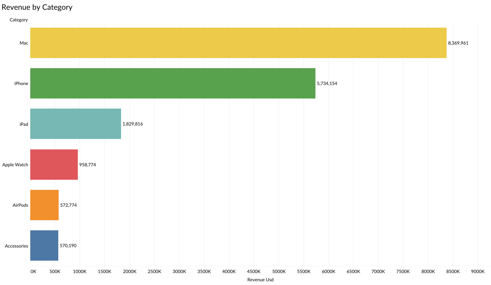
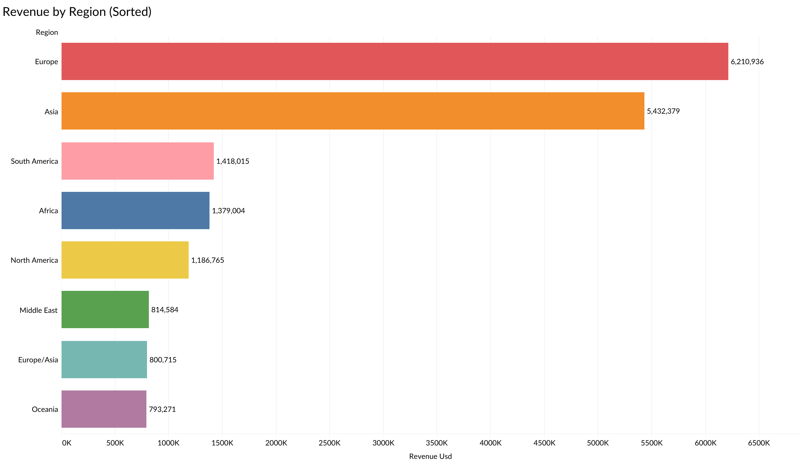
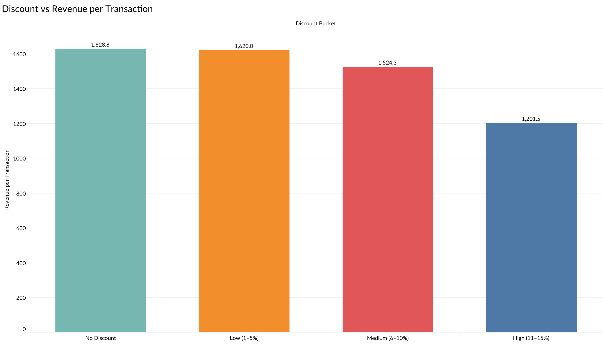
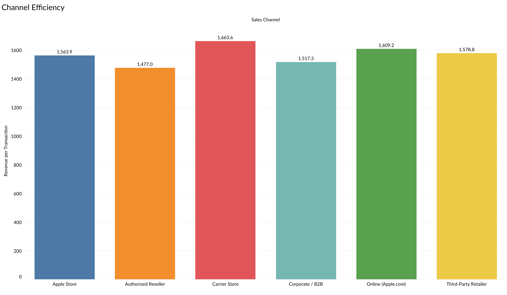
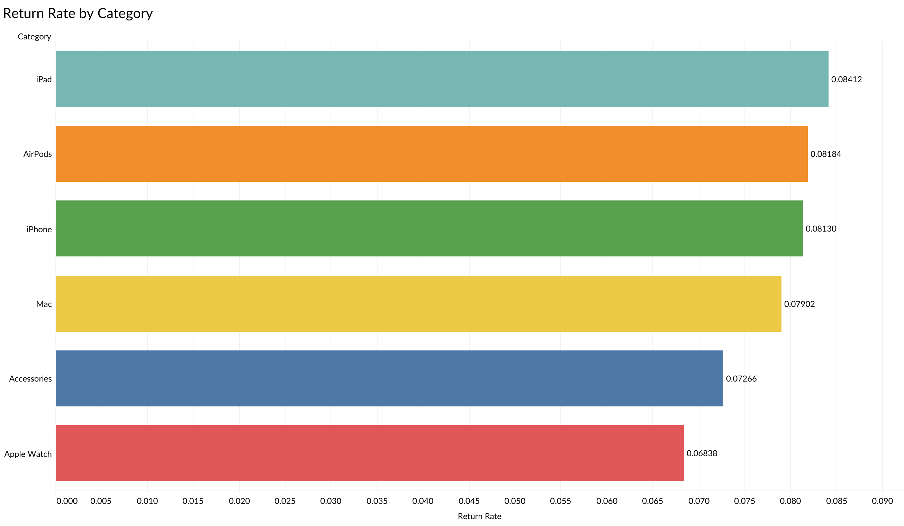
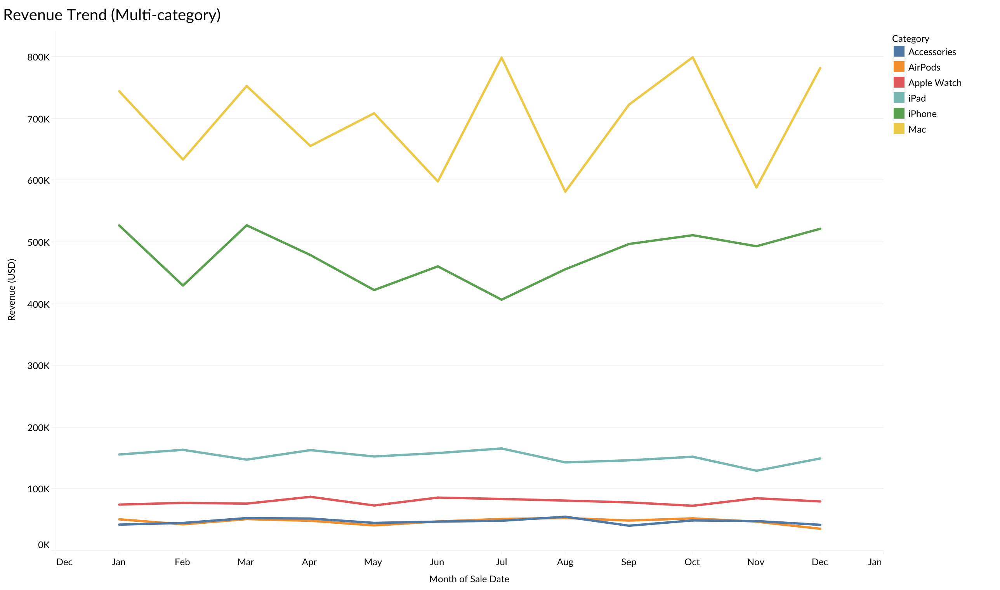

# Revenue Efficiency Optimization

**Pricing, channel and customer analysis of 11,500 Apple product transactions (2022-2024)**

Which levers actually move revenue, and which ones only look like they do? This project analyzes a transaction-level sales dataset to find where revenue is concentrated, what discounting buys, whether channels and regions differ, and how large the return exposure is. Every claim is tested, and the analysis states plainly what the data does not support.

| Transactions | Net revenue | Period | Coverage |
| :--- | :--- | :--- | :--- |
| 11,500 | $18.04M | Jan 2022 to Dec 2024 | 47 countries, 43 products, 6 categories, 6 channels |

> **Data note.** The dataset is synthetic. It is not real Apple sales data, and the findings demonstrate the method more than they describe a real business.

## Contents

- [Executive summary](#executive-summary)
- [Business questions](#business-questions)
- [Dataset](#dataset)
- [Methodology](#methodology)
- [Findings](#findings)
- [Recommendations](#recommendations)
- [Limitations](#limitations)
- [Reproduce](#reproduce)

## Executive summary

Revenue is driven by a small set of high-ticket products. Discounting is a real but modest lever. Regional, channel, customer and return differences that look meaningful in a chart are mostly not distinguishable from noise.

1. **Revenue depends on a few high-ticket products, not on a few markets.** Mac, iPhone and iPad produce 88% of revenue from 58% of transactions. One product, the Mac Pro (M2 Ultra), generates 20.6% of revenue from 2.4% of transactions, and the top 10% of transactions carry 47% of revenue.
2. **Europe and Asia hold 65% of revenue because they cover 30 of the 47 countries.** Revenue per country is flat across regions ($0.34M to $0.41M), so "core regions" reflect footprint, not stronger demand.
3. **Discounts cost $0.70M (3.7% of list revenue) and show no basket-size payoff.** Units per transaction stay at about 2.0 at every discount depth. The deepest tier (15%) is 9% of transactions but 31% of all discount dollars.
4. **Channel differences are not statistically supported.** The best channel leads the weakest by 12.6% on mean revenue per transaction, but the gap is not significant (p = 0.63) and medians are within 4%.
5. **Returns are a systemic 8% revenue exposure.** 7.8% of transactions are returned, tied to $1.48M (8.2%) of revenue. No dimension tested (category, channel, region, segment, age, payment, year, discount) explains the variation.
6. **Revenue is flat and not seasonal.** 2024 revenue is 3.1% above 2022 while transactions are 0.8% lower, so growth comes from ticket size. There is no month-of-year effect (p = 0.53).

> **Bottom line.** Manage the concentration risk in high-ticket products first, tighten discount rules second, and do not reallocate channels or regions on the current evidence.

## Business questions

1. Where is revenue concentrated: by product, category, region and order size?
2. What does discounting buy, and what does it cost?
3. Do sales channels differ in revenue efficiency?
4. Is return risk concentrated in specific products, channels or customers?
5. Is there real growth or seasonality in the period?

## Dataset

One row per transaction (`sale_id` is unique), 27 fields in six groups.

| Group | Fields |
| :--- | :--- |
| Transaction | `sale_id`, `sale_date`, `year`, `quarter`, `month` |
| Product | `product_name`, `category`, `storage`, `color`, `previous_device_os` |
| Geography | `country`, `region`, `city` |
| Pricing | `unit_price_usd`, `discount_pct`, `discounted_price_usd`, `units_sold`, `revenue_usd`, `currency`, `fx_rate_to_usd`, `revenue_local_currency` |
| Channel and customer | `sales_channel`, `payment_method`, `customer_segment`, `customer_age_group` |
| Outcome | `customer_rating`, `return_status` (Kept, Returned, Exchanged) |

### Data quality checks

| Check | Result |
| :--- | :--- |
| Uniqueness | No duplicate rows and no duplicate `sale_id`. |
| Price identity | `discounted_price = unit_price × (1 - discount)`. Maximum difference $0.005 (rounding). |
| Revenue identity | `revenue = discounted_price × units`. Maximum difference $0.00. |
| FX consistency | `revenue_local = revenue_usd × fx_rate`. Maximum relative difference 0.02% (rounding). |
| Calendar fields | `year`, `quarter` and `month` agree with `sale_date` on every row. |
| Structural nulls | `storage` is empty for AirPods, Apple Watch and Accessories (41.8% of rows). `previous_device_os` is filled only for iPhone (70.1% null). Both are expected, not errors. |
| Missing ratings | 29.2% of `customer_rating` is missing. The share is similar across return status (27% to 29%) and category, so ratings are analyzed on the available rows without adjustment. |
| Region label | Russia and Turkey are labeled `Europe/Asia` and kept as reported. Merging the label into Europe lifts the Europe share from 34% to 39% and does not change any conclusion. |
| Discount values | `discount_pct` takes only seven values (0, 2, 3, 5, 7, 10, 15), grouped into four buckets for analysis. |

## Methodology

- **Metric definitions.** *Revenue* is `revenue_usd`, net of discount. *List revenue* is `unit_price_usd × units_sold`. *Return rate* counts `Returned` only, and exchanges (4.0%) are reported separately. Discount buckets are No Discount, Low (1-5%), Medium (6-10%) and High (11-15%).
- **Skewed metric, robust methods.** Revenue per transaction is strongly right-skewed (mean $1,568, median $833, skewness 7.2), so comparisons pair means with medians and use rank-based tests.
- **Tests.** Kruskal-Wallis and Mann-Whitney for revenue across groups, chi-square for proportions, Spearman for monotonic relationships, a bootstrap confidence interval for the channel gap, and a Type II ANOVA on log revenue to control for category.
- **Significance.** Alpha is 0.05 with no multiple-testing correction. With about 30 tests, results between 0.05 and 0.10 are treated as inconclusive rather than as findings.
- **Tools.** Python (pandas, SciPy, statsmodels) for validation and testing, Tableau for the charts.
- **Reproducibility.** Every figure in this README is produced by [`analysis/revenue_efficiency_analysis.ipynb`](analysis/revenue_efficiency_analysis.ipynb).

## Findings

### 1. Revenue depends on a few high-ticket products



*Figure 1. Revenue by product category, 2022-2024 (USD).*

| Category | Revenue share | Transaction share | Revenue per transaction |
| :--- | ---: | ---: | ---: |
| Mac | 46.4% | 16.3% | $4,469 |
| iPhone | 31.8% | 29.9% | $1,665 |
| iPad | 10.1% | 12.0% | $1,327 |
| Apple Watch | 5.3% | 9.8% | $851 |
| AirPods | 3.2% | 9.2% | $539 |
| Accessories | 3.2% | 22.7% | $218 |

- **Product level.** The Mac Pro (M2 Ultra) alone is 20.6% of revenue from 2.4% of transactions. Twenty of the 43 products account for 80% of revenue.
- **Order size.** The top 1% of transactions carry 14.3% of revenue, the top 5% carry 33.6% and the top 10% carry 47.1%.
- **Volatility.** Monthly revenue varies more than volume (coefficient of variation 10.9% versus 6.2% for transaction count). Mac explains 81% of the variance in monthly revenue, and the Mac Pro alone explains 57%.

> **Implication.** Revenue forecasts and targets are only as stable as a few large orders. Report medians and trimmed metrics next to means, and forecast the high-ticket pipeline separately.

### 2. Regional concentration reflects footprint, not stronger markets



*Figure 2. Revenue by region, 2022-2024 (USD).*

| Region | Countries | Revenue share | Revenue per country |
| :--- | ---: | ---: | ---: |
| Europe | 16 | 34.4% | $0.39M |
| Asia | 14 | 30.1% | $0.39M |
| South America | 4 | 7.9% | $0.35M |
| Africa | 4 | 7.6% | $0.34M |
| North America | 3 | 6.6% | $0.40M |
| Middle East | 2 | 4.5% | $0.41M |
| Europe/Asia | 2 | 4.4% | $0.40M |
| Oceania | 2 | 4.4% | $0.40M |

- Europe and Asia contribute 64.6% of revenue and cover 30 of the 47 countries.
- Every country records between 208 and 274 transactions, and revenue per transaction does not differ by region (Kruskal-Wallis p = 0.47).

> **Implication.** The raw regional chart overstates market concentration. "Expand beyond core regions" is not supported, because no region outperforms per country.

### 3. Discounts cost 3.7% of list revenue and show no basket-size payoff



*Figure 3. Mean revenue per transaction by discount bucket (USD).*

| Discount bucket | Transaction share | Share of discount dollars | Mean revenue per transaction | Median | Units per transaction |
| :--- | ---: | ---: | ---: | ---: | ---: |
| No Discount | 45.4% | 0% | $1,629 | $866 | 2.0 |
| Low (1-5%) | 26.8% | 24.9% | $1,620 | $834 | 2.0 |
| Medium (6-10%) | 18.7% | 43.7% | $1,524 | $787 | 2.0 |
| High (11-15%) | 9.0% | 31.4% | $1,201 | $706 | 2.0 |

- **The 26% drop is mostly arithmetic.** Mean revenue per transaction is 26.2% lower in the High bucket, but that bucket is entirely the 15% tier, so 15 points are the price cut itself. The median falls 18.4%, and list value and unit price do not differ across buckets (p = 0.50 and 0.44), so the remainder comes from a few large orders.
- **No basket-size payoff.** Units per transaction are flat at every discount depth (Spearman rho = -0.004, p = 0.68), and ratings are unrelated to discount (p = 0.20). Transaction-level data cannot show whether discounts attract additional orders.
- **Discounts are untargeted.** 54.6% of transactions are discounted, and the 15% tier is 8% to 10% of transactions in every category, channel, segment and region (chi-square p > 0.39).
- **Sizing.** Capping the 15% tier at 10% would recover about $73K (0.41% of revenue) if demand did not change. The cap breaks even unless it costs more than 5.6% of that tier's units.

> **Implication.** Discounting is a real but small lever. The case for changing it is discipline and targeting, not a large revenue prize.

### 4. Channel differences are not statistically supported



*Figure 4. Mean revenue per transaction by sales channel (USD).*

| Channel | Transactions | Revenue share | Mean per transaction | Median per transaction |
| :--- | ---: | ---: | ---: | ---: |
| Carrier Store | 1,917 | 17.7% | $1,664 | $827 |
| Online (Apple.com) | 1,940 | 17.3% | $1,609 | $829 |
| Third-Party Retailer | 1,892 | 16.6% | $1,579 | $849 |
| Apple Store | 1,914 | 16.6% | $1,564 | $834 |
| Corporate / B2B | 1,912 | 16.1% | $1,517 | $840 |
| Authorized Reseller | 1,925 | 15.8% | $1,477 | $820 |

- The mean gap between the top and bottom channel is 12.6%, but Kruskal-Wallis gives p = 0.63 and the bootstrap 95% CI for the gap is -$4 to $366. Medians differ by less than 4%.
- After controlling for category, the channel effect is p = 0.089, which is inconclusive.
- **Power caveat.** With about 1,900 transactions per channel, only gaps of roughly 16% or more can be detected. A moderate real difference cannot be ruled out.

> **Implication.** The data gives no basis for shifting investment between channels. A controlled test with margin data would settle it.

### 5. Returns are a systemic 8% revenue exposure



*Figure 5. Return rate by product category (share of transactions).*

- 7.8% of transactions are returned and another 4.0% are exchanged, so 11.8% are not kept.
- Returned transactions represent $1.48M, or 8.2% of revenue.
- Return rates run from 6.8% (Apple Watch) to 8.4% (iPad), but the 95% intervals overlap and the category difference is not significant (p = 0.55).
- No other dimension explains returns: channel (p = 0.51), region (0.72), customer segment (0.28), age group (0.34), payment method (0.69), year (0.21) and discount depth (0.37). Ratings are unrelated to returns (p = 0.31).

> **Implication.** Returns behave like a systemic process cost rather than a defect in one product or channel, so the fix belongs in policy and quality processes. Return reasons are needed to go further.

### 6. Revenue is flat, growth comes from ticket size, and there is no seasonality



*Figure 6. Monthly revenue by category, 2022-2024 (USD).*

| Year | Revenue | Year on year | Transactions | Revenue per transaction |
| :--- | ---: | ---: | ---: | ---: |
| 2022 | $6.03M | n/a | 3,898 | $1,547 |
| 2023 | $5.79M | -4.0% | 3,735 | $1,549 |
| 2024 | $6.22M | +7.5% | 3,867 | $1,608 |

- 2024 revenue is 3.1% above 2022, while transactions are 0.8% lower and revenue per transaction is 3.9% higher.
- There is no month-of-year effect on daily revenue (p = 0.53), and Q4 is only 4.0% above the average of the other quarters.
- The sharp monthly swings in the Mac line come from a small number of large orders (finding 1), not from seasonality.

### 7. Customer segments do not separate

Revenue per transaction does not differ by customer segment (p = 0.78), age group (p = 0.38) or payment method (p = 0.40), and average ratings are about 4.0 in every category (p = 0.85). Customer-level targeting has no support in this dataset.

## Recommendations

| # | Recommendation | Evidence | Expected impact | Confidence |
| :--- | :--- | :--- | :--- | :--- |
| 1 | **Plan around high-ticket dependency.** Track the Mac and Mac Pro pipeline separately and report medians alongside means. | Mac Pro is 20.6% of revenue. The top 10% of orders carry 47%. | Lower forecast error and earlier warning on revenue risk. | High |
| 2 | **Replace blanket discounting with rules.** Cap or require justification for the 15% tier, and test discount depth in a controlled experiment. | $0.70M given away with no basket-size lift. The 15% tier is untargeted. | About $73K (0.4% of revenue) if demand holds. | Medium (demand response untested) |
| 3 | **Treat returns as a process problem.** Standardize return reason codes and review policy and quality controls. | 8.2% of revenue is tied to returns. No segment explains the rate. | Returns are the largest cost pool visible in the data. | Medium (causes not observable) |
| 4 | **Hold channel and regional reallocation** until it is tested with margin data. | Channel gap is not significant and revenue per country is flat, so the evidence is insufficient to act. | Avoids moving budget on noise. | High |
| 5 | **Improve the data.** Add cost and margin, customer IDs, traffic and conversion, and return reasons. | Each open question above needs one of these. | Enables profitability, elasticity and retention analysis. | High |

## Limitations

- **Synthetic data.** The uniformity in this dataset (208 to 274 transactions per country, ratings near 4.0 in every group, discounts unrelated to any attribute) is typical of generated data. The findings may not transfer to real sales.
- **No cost or traffic data.** Profitability, discount elasticity and conversion cannot be measured. The discount analysis covers basket size only.
- **Non-significant does not mean no effect.** The channel test can only detect gaps of about 16% or more.
- **Observational data.** The analysis supports association, not causation. The discount sizing assumes demand is unchanged.
- **Multiple comparisons.** About 30 tests were run at a nominal 0.05 level with no correction, so borderline results are treated as inconclusive.
- **Return definition.** The return rate counts `Returned` only. Including exchanges raises the non-kept share to 11.8%.

## Next steps

- Add unit cost and margin to move from revenue efficiency to profit efficiency.
- Run a controlled discount test on the 10% and 15% tiers, measuring conversion as well as basket size.
- Add return reason codes and repeat the returns analysis by cause.
- Link transactions to customer IDs to study repeat purchase and lifetime value.

## Reproduce

```bash
pip install -r requirements.txt
jupyter notebook analysis/revenue_efficiency_analysis.ipynb
```

Run all cells from top to bottom. The notebook reproduces every number quoted above, grouped by section, and its saved outputs are already visible on GitHub without running anything.

### Repository structure

```
.
├── README.md
├── requirements.txt
├── apple_global_sales_dataset.csv
├── analysis/
│   └── revenue_efficiency_analysis.ipynb
├── revenue-by-category.png
├── revenue-by-region.png
├── discount-vs-revenue.png
├── channel-efficiency.png
├── return-rate-category.png
└── revenue-trend.png
```
