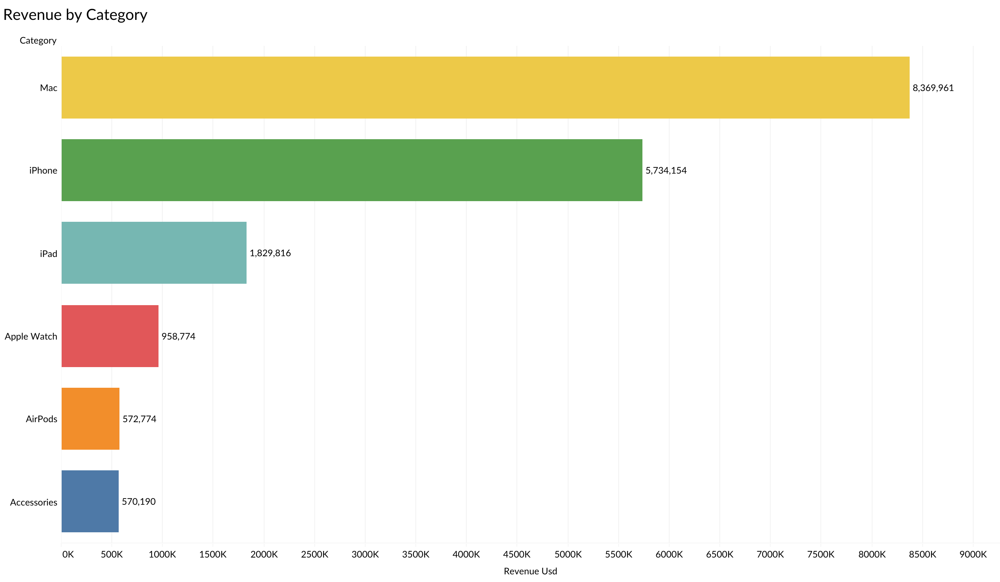
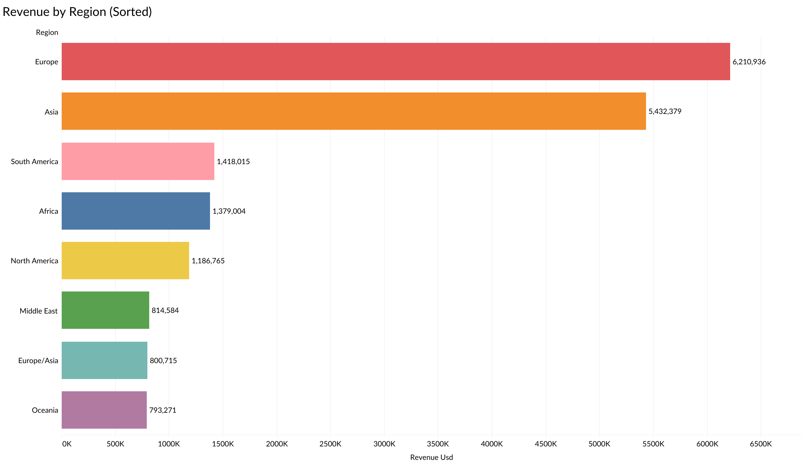
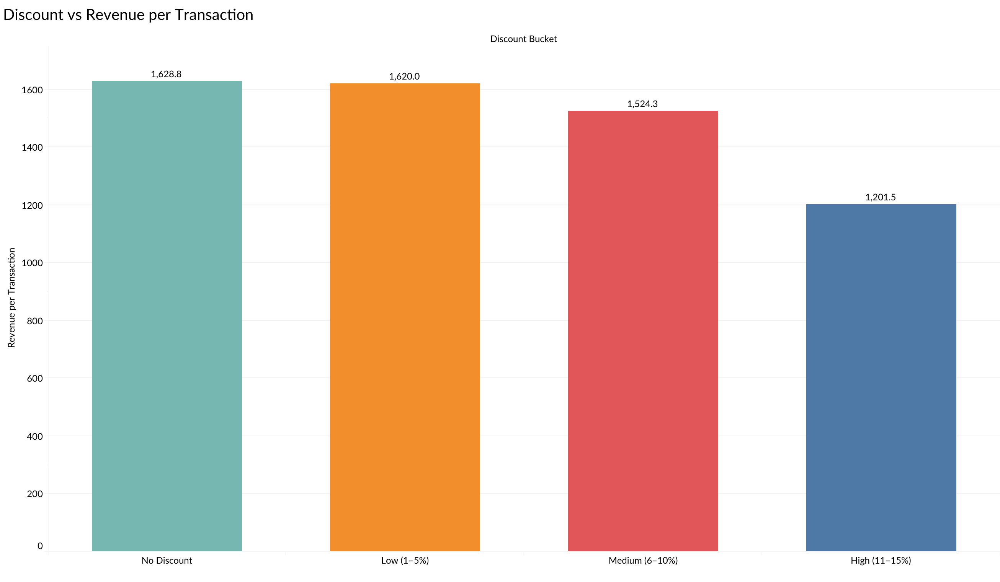
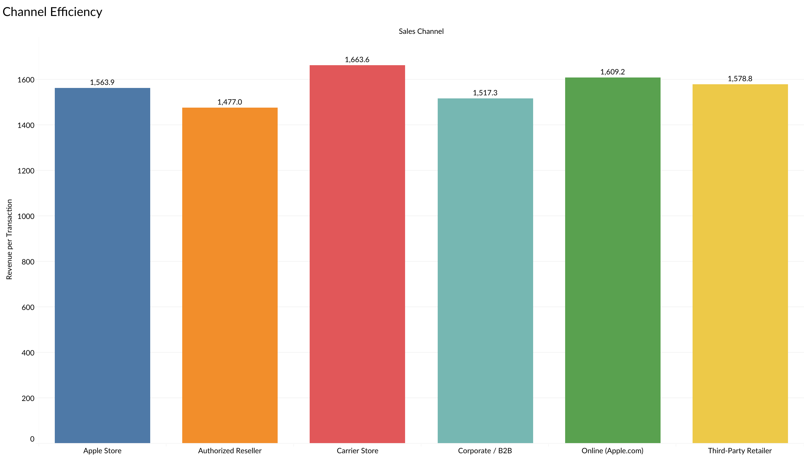
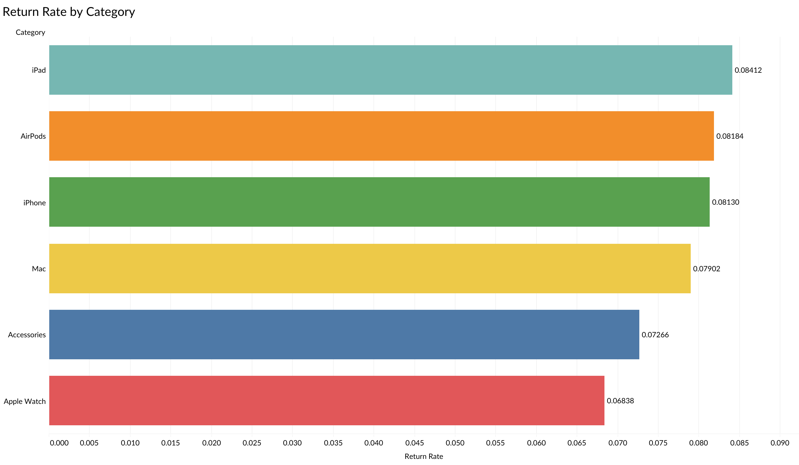
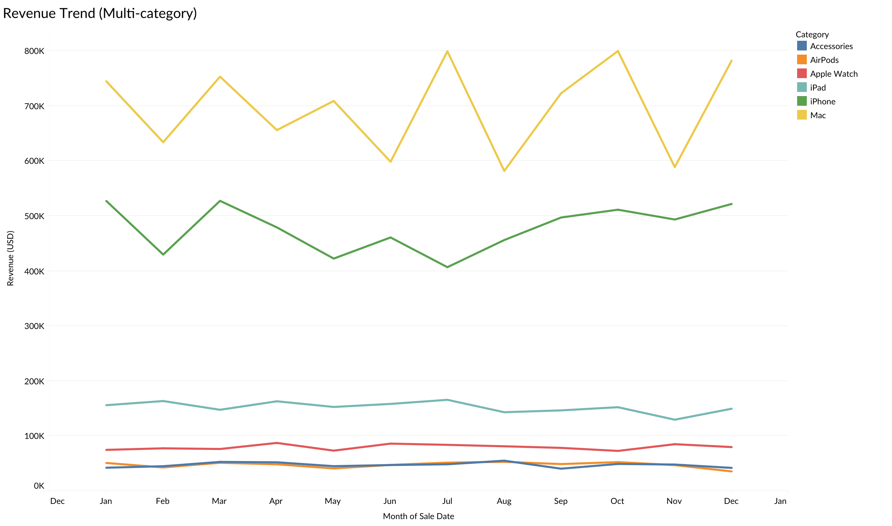

# Revenue Efficiency Analysis: Apple Global Sales

An analysis of 11,500 Apple product transactions from 2022 to 2024, covering 47 countries, 43 products, 6 categories and 6 sales channels, with $18.04M in net revenue. I wanted to find out which levers actually move revenue and which ones only look like they do: where the money is concentrated, what discounts buy, whether channels and regions really differ, and how much is lost to returns.

My answer: revenue depends on a handful of expensive products, discounts cost more than they return, and most of the differences between regions, channels and categories are too small to act on.

The data is a synthetic dataset, not real Apple sales, so the findings show how I approach this kind of question more than they describe the actual business. Analysis was done in Python (pandas) and the charts were built in Tableau.

## Data

One row per transaction, with date, country, product, category, price, discount, units, revenue, sales channel, customer segment and return status. Before analyzing anything I checked that the numbers add up: no duplicate transactions, discounted price matches price minus discount, revenue matches discounted price times units, and the date fields agree with each other. Everything held up, so no rows were removed.

Two things looked like gaps but are not. Storage is empty for AirPods, Apple Watch and Accessories because those products have no storage option, and previous device OS is only filled in for iPhone. Both are expected. Revenue throughout is net of discount, and a return counts only when the status is Returned. Exchanges are 4% of transactions and are left out of the return rate.

## Revenue depends on Mac and iPhone

Mac brings in $8.37M and iPhone $5.73M, which is 46% and 32% of revenue. Together they make up 78%, and adding iPad takes it to 88%. Accessories is the opposite case: 23% of all transactions but only 3% of revenue, because the average accessory order is $218 against $4,469 for a Mac.

It gets more concentrated further down. One product, the Mac Pro with M2 Ultra, produces 20.6% of revenue from 2.4% of transactions, and the top 10% of orders carry 47% of all revenue. A forecast for this business is mostly a forecast of how many large Mac orders land in a given month, so I would track that pipeline separately and report medians next to averages.

## Europe and Asia lead because they cover more countries

Europe ($6.21M) and Asia ($5.43M) make up about 65% of revenue, which looks like a clear core market. But those two regions cover 30 of the 47 countries. Divide revenue by the number of countries and almost every region lands between $0.34M and $0.41M per country. North America and the Middle East, which look small on the chart, earn as much per country as Europe does.

So the chart reflects how many countries each region has, not stronger demand. I would not read it as a reason to push harder in Europe and Asia, or to expand into regions that "perform well".

## Discounts cost $0.70M and do not increase basket size

Discounts gave away $0.70M, or 3.7% of list revenue. Revenue per transaction falls from $1,629 with no discount to $1,201 in the highest bucket, a drop of 26%. Most of that is arithmetic. The highest bucket is entirely the 15% tier, so 15 of those 26 points are just the price cut, and the rest comes from a few large orders.

The more useful number is units per transaction, which stays at about 2.0 in every bucket. Customers who got a bigger discount did not buy more. The 15% tier is only 9% of transactions but accounts for 31% of discount dollars, and it shows up at the same rate in every category and channel, so it is not being aimed at anyone in particular. Capping it at 10% would recover roughly $73K if demand held, which is small. This data has no traffic or conversion numbers, so I cannot say whether discounts bring in extra orders, only that they do not make orders bigger.

## Channels look different, but not by much

Carrier Store leads at $1,664 per transaction and Authorized Reseller trails at $1,477, a gap of 12.6%. That sounds meaningful until you look at the medians, which sit between $820 and $849 across all six channels, within about 4% of each other. A few very large orders are lifting the averages for some channels, and each channel has around 1,900 transactions, so the ranking could easily change with a different sample.

I would not move budget between channels based on this. A fair comparison needs margin data and a controlled test.

## Returns take about 8% of revenue, evenly

7.8% of transactions are returned, tied to $1.48M or 8.2% of revenue. By category the rate runs from 6.8% for Apple Watch to 8.4% for iPad, a narrow range with no category standing out. The same holds when I split returns by channel, region, customer segment and discount level. Nothing explains why one group returns more.

That points to returns being a general process cost and not a problem with one product or one channel. Fixing it probably means return policy and quality checks across the board, and the dataset has no return reasons to take it further.

## No seasonality, and Mac drives the swings

This chart sums each calendar month across all three years, so it shows seasonality and not growth. There is no real holiday peak. Q4 is only about 4% above the other quarters. The lines for iPad, Apple Watch, AirPods and Accessories are almost flat, and iPhone moves in a narrow band.

The swings come from Mac, which jumps between roughly $580K and $800K from one month to the next. That is the same effect as the concentration finding: a few large Mac orders decide whether a month looks strong or weak. For growth, 2024 revenue is 3.1% above 2022 while transaction count is 0.8% lower, so the increase comes from bigger tickets and not from more customers.

## What I would do with this

1. Treat Mac as a risk to manage. Forecast the Mac and Mac Pro pipeline on its own and use medians alongside means in reporting.
2. Replace blanket discounting with rules. Require a reason for the 15% tier and test discount depth properly before changing it further.
3. Treat returns as a process problem, starting with standard return reason codes so the next analysis can find causes.
4. Hold off on reallocating budget across channels or regions until margin data and a controlled test say it is worth it.

## Limitations

The data is synthetic. Transactions per country (208 to 274), ratings near 4.0 in every group and discounts unrelated to any customer trait are all signs of generated data, so the "no difference" findings may not carry over to real sales. There is no cost, margin, traffic or customer ID data, which rules out profit, discount elasticity and repeat purchase analysis. The analysis shows association only, and the $73K discount estimate assumes demand stays the same.

If I had more data, I would add unit cost to move from revenue to profit, link transactions to customers to study repeat buying, and collect return reasons.
